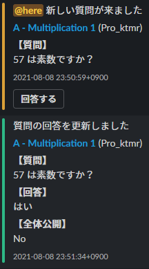

# atcoder-clar-to-slack
AtCoder の質問タブの更新情報を Slack に通知します．Owner 権限を有していることを前提としています．

## 使い方
次の例を参考に `config.yml` を設置してください．

```yaml
USERNAME: 'username' # AtCoder のユーザ名
PASSWORD: 'password' # AtCoder のパスワード
CLAR_URL: 'https://atcoder.jp/contests/hoge/clarifications'
INTERVAL: 10 # 単位：秒
SLACK_URL: 'https://hooks.slack.com/services/hoge' # Webhook URL
```

あとは普通に `atcoder-clar-to-slack.py` を実行したら動きます．

## スクリーンショット


## 動作確認
2021/08/08 版の AtCoder で正常な動作を確認しています．

## 参考
- [icpc-jag/atcoder-clar2slack](https://github.com/icpc-jag/atcoder-clar2slack)
- [inada-s/atclar](https://github.com/inada-s/atclar)
